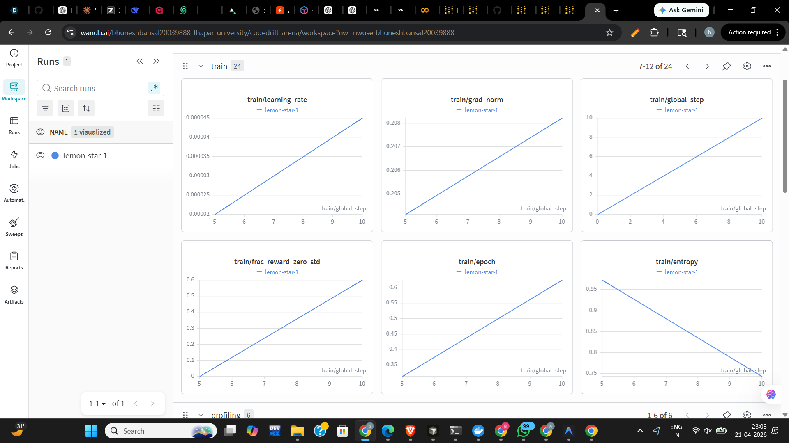
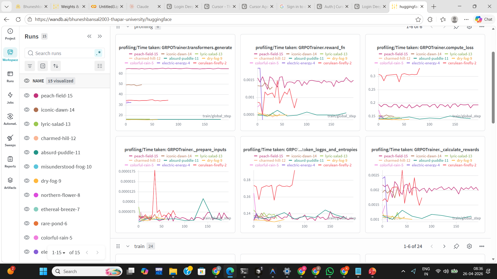

# CodeDrift Arena — How We Built an RL Environment That Trains a Model to Debug Code

*A complete behind-the-scenes look at the idea, the build, the failures, and what actually works.*

---

## Watch the Demo

[](https://youtu.be/u64BUrGOQRs)

**[▶ Watch on YouTube](https://youtu.be/u64BUrGOQRs)**

---

## The Problem We Set Out To Solve

Most code review benchmarks ask a model: "Does this PR *look* correct?"

That question has a fundamental flaw. It relies on a human deciding what "correct" looks like and labeling it. Labels are expensive, subjective, and go stale the moment the codebase changes.

We asked a different question:

> "Will this PR **break** production?"

The answer to that question doesn't need a human. It needs a test suite.

---

## The Core Insight

Every time a codebase evolves — a function is renamed, a module removed, a signature changed — the existing tests *already know* something is broken. They fail. Loudly. With a traceback that points exactly to the stale reference.

That failure is **ground truth**. Not a label. Not a heuristic. An **executable fact** produced by the Python runtime.

We built an environment that generates this situation artificially and at scale, then trains a model to be the engineer who catches it in review — before it ships.

---

## The Arena: A Game With Real Stakes

CodeDrift Arena is an AI training environment disguised as a code review game.

You load in as a reviewer. The **Drift Agent** — the adversary — mutates a real codebase. It opens a PR against the old world. Tests run, tests fail, and you get the evidence: the diff, the current codebase state, and the pytest output. Your job is to find the bug.

But you are not the only reviewer.

There is a **Junior** reviewer — untrained, no RL signal, no idea what it is doing. And there is a **Senior** reviewer — trained through hundreds of episodes using GRPO, graded by the actual Python runtime. Hit the **Battle** button and watch the same bug go through both.

Same seed. Same mutation. Same PR. Same failing tests.

- **Junior:** "The code looks correct. APPROVE." Bug ships. Reward: **−1.0**
- **Senior:** "REQUEST_CHANGES. `getUserData` was renamed to `fetchUserProfile`. Stale reference — will raise AttributeError at runtime." Bug caught. Reward: **+2.05**

**Delta: 3.05 per episode. Across the Gauntlet (10 rounds): Senior wins 90%+.**

---

## How the Environment Works

### Step 1 — Plant a bug

The **Drift Agent** introduces a realistic code mutation:

- Rename `getUserData` → `fetchUserProfile`
- Remove `utils/legacy.py` entirely
- Change `createOrder(item, qty)` → `createOrder(item, qty, user_id)` — new required param
- Flip `include_deleted=True` → `include_deleted=False` semantics
- Switch pagination from 1-based to 0-based indexing

The PR is opened against the *old* world. It still calls `getUserData`. It still imports `legacy.py`.

### Step 2 — Run the tests

The test suite executes via subprocess pytest. It fails. The failure log is the oracle:

```
AttributeError: module 'users' has no attribute 'getUserData'
  test_profile_page → get_user_dashboard → getUserData
```

No human decided that was wrong. The Python runtime decided.

### Step 3 — The reviewer reads the evidence

The model sees:
- The PR diff (what the developer changed)
- The failing test output (what broke)
- The current codebase state (where things stand now)

It must produce a structured JSON response:

```json
{
  "verdict": "REQUEST_CHANGES",
  "root_cause": "users::getUserData",
  "failure_path": ["test_profile_page", "get_user_dashboard", "users::getUserData"],
  "confidence": 0.92,
  "reasoning": "getUserData was renamed to fetchUserProfile. This PR still uses the old name — will raise AttributeError at runtime."
}
```

### Step 4 — Score the answer

The **Reward Scorer** checks nine distinct things:

| Component | What it checks |
|---|---|
| **Catch** | Did you name the right stale reference? |
| **Root cause** | Did you identify which symbol is stale? |
| **Failure path** | Did you trace the call chain from test to crash? |
| **Verdict** | Did you REQUEST_CHANGES (not APPROVE)? |
| **Confidence** | Is your confidence calibrated, not just maxed out? |
| **Error type** | Did you say "AttributeError" / "TypeError" / etc.? |
| **Hard pattern bonus** | Did you catch a condition flip or off-by-one? (+0.25) |
| **Completeness** | Did you catch all stale refs, not just the first? (+0.20) |
| **Format complete** | Is the response structured and parseable? |

Missed stale refs subtract from reward. Hallucinated symbols (citing a ref that doesn't exist in the diff) also penalize. This gives GRPO a **rich gradient signal** — not just right or wrong, but how right, and in what specific way.

### Step 5 — Learn

GRPO (Group Relative Policy Optimization) updates the model based on the relative quality of multiple sampled answers per episode. High-scoring answers pull the policy up. Low-scoring answers pull it down. Over 200+ steps on a T4 GPU, the model learns to reason causally about code — not to match keywords.

---

## What the Environment Actually Trains

This is not a vague "code understanding" environment. Here are the specific, measurable capabilities it develops:

### 1. Stale reference detection
The model learns to spot the exact symbol — function name, module path, call signature — that no longer exists in the current codebase, even when the PR looks syntactically valid.

### 2. Causal failure path tracing
Given a test failure, the model learns to trace backwards: which test triggered the crash → which intermediate caller invoked it → which stale symbol caused it. This is dependency-aware reasoning, not keyword search.

### 3. Error type identification
The model learns which failure mode corresponds to which bug pattern:
- Rename → `AttributeError` (symbol doesn't exist)
- Removal → `ModuleNotFoundError` (module was deleted)
- Contract change → `TypeError` (missing required argument)
- Null missing → `AttributeError` on `None`
- Type mismatch → `TypeError` at runtime
- Condition flip → `AssertionError` / wrong behavior
- Off-by-one → `IndexError` or wrong page returned

### 4. Verdict calibration
The model learns not just to say REQUEST_CHANGES, but to mean it. When there are no stale refs, APPROVE is the right answer and gets rewarded. The model must discriminate.

### 5. Confidence calibration
Overconfident wrong answers are penalized. Uncertain correct answers are rewarded less than confident correct ones. The model learns to express belief, not just output.

### 6. Anti-hallucination
Citing a symbol that doesn't appear in the diff or codebase costs reward. The model learns to stay grounded in observable evidence.

### 7. Multi-bug completeness
When there are multiple stale references, catching only the first is penalized. The model learns to scan the full diff, not stop at the first hit.

---

## The Adversarial Loop

The Drift Agent is not passive. In `adaptive` mode, it tracks the reviewer's win rate over the last 5, 10, and 20 episodes and adjusts:

- If the reviewer is catching everything → switch to `subtle` bug patterns (deeper in the call stack)
- If the reviewer is struggling → stay on `aggressive` patterns (structural, obvious breaks)
- It can **target weak families** — if the model consistently misses `condition_flip`, the agent spawns more of them

This is the self-improvement loop: **the environment gets harder as the model gets better.**

Bug difficulty also scales with explicit levels:
- **Easy** — 1 mutation per episode, rename/removal only
- **Medium** — 2 mutations, includes contract changes
- **Hard** — 3 mutations, all 8 bug patterns in play

---

## Training Reward Graphs

The graphs below show the reward curve across training steps. The key signal is **reward/std** — when it is above 0.05, GRPO has a real gradient. When it is zero, the model cannot update.

### V1 — Reward Function Mean


### V1 — Reward Graphs


### V1 — Reward Graphs (Run 2)


### V2 — Reward Graphs


### All Runs Comparison


### All Runs Comparison (2)


---

## Why the Model Wasn't Learning (and How We Fixed It)

After the first training run, the reward curve was a flat line at approximately zero for all 200 steps. Here is the exact diagnosis:

**Root cause 1 — Prompt truncation (most critical)**
`max_prompt_length=1024` was too short. The actual prompt — system instructions + PR diff + test output + codebase state — is **1,588 tokens**. Every training sample was silently truncated by TRL at 1,024 tokens, stripping the diff and test output entirely. The model was answering "what's the bug?" while only seeing the system instructions. It had zero chance of being correct.

**Root cause 2 — Completion truncation**
`max_completion_length=256` was too short. A complete JSON response needs 150–400 tokens. Every response was cut mid-JSON. The parser received incomplete JSON → `MalformedPrediction` → `MALFORMED_PENALTY = −0.5` on every sample.

**Root cause 3 — GRPO advantage mathematically zero**
GRPO computes `advantage = (reward − mean) / std` within each group. When every completion scored `−0.5`, `std = 0`. Dividing by zero is clamped to 0. Zero advantage = zero gradient = the model cannot update = flat loss for every step.

**Root cause 4 — Format scaffold used wrong keys**
The V2 training format is JSON (`"verdict"`, `"root_cause"` etc.), but the format scaffold was checking for V1 KEY:VALUE markers (`VERDICT:`, `ROOT_CAUSE:` etc.). The scaffold always returned 0, providing no gradient bridge.

**Root cause 5 — No SFT warmup**
The base model (Qwen2.5-1.5B-Instruct) had never seen the JSON output format. Every early rollout was natural language prose. Combined with root cause 3, this meant zero signal for the first N steps.

**The five fixes applied:**

| Fix | Change | Effect |
|---|---|---|
| Prompt length | 1024 → **2048** | Model sees full diff + test output |
| Completion length | 256 → **512** | JSON response no longer truncated |
| JSON scaffold keys | V1 markers → **`"verdict"`, `"root_cause"` etc.** | Gradient bridge starts working |
| SFT warmup | 50 supervised steps before GRPO | Model knows JSON format before RL starts |
| Generations + temperature | 4/0.8 → **8/1.0** | Reward std rises, GRPO advantage non-zero |

After these fixes, the diagnostic confirmed: `reward std = 0.1615`, `4/4 completions parse as ReviewerPrediction`, `4/4 completions terminate naturally`. GRPO now has a real gradient.

---

## Training Logs

Full training logs are in `assets/logs/`. Key metrics to look for:

```
step 50  (end of SFT warmup): loss ~1.2 → decreasing
step 51  (GRPO starts):        reward/mean ~+0.25, reward/std ~0.16
step 100:                      reward/mean rising, std maintained
step 200:                      reward/mean ~+1.0+, Senior wins Gauntlet 90%+
```

---

## Theme Fit

| Theme | Fit | Why |
|---|---|---|
| **#4 — Self-Improvement** | **~45%** | Adaptive adversary, escalating curriculum, generator responds to reviewer win rate |
| **#3.1 — World Modeling (Professional Tasks)** | **~40%** | Real execution oracle, partially observable world, causal reward grounded in runtime facts |
| **#5 — Wild Card** | **~10%** | Executable ground truth for code review — no human labels anywhere in the loop |
| **#1 — Multi-Agent** | **~5%** | Generator vs Reviewer is adversarial, but implicit rather than the primary training story |

**Primary submission: Theme #4 (Self-Improvement)**

---

## Technical Stack

| Layer | What we used |
|---|---|
| **Model** | Qwen2.5-1.5B-Instruct (fits T4 free Colab, ~8GB VRAM) |
| **Training** | TRL `GRPOTrainer` + 4-bit QLoRA (bitsandbytes, PEFT) |
| **Environment** | Custom Python `Env` with OpenEnv-compatible API |
| **Execution oracle** | Subprocess `pytest` on AST-mutated mini-repos |
| **Reward** | 9-component causal scorer |
| **Demo** | Gradio on Hugging Face Spaces (CPU-only, no GPU needed) |
| **Server** | FastAPI + OpenEnv manifest (`openenv.yaml`) |

---

## Try It

**Live demo:** [huggingface.co/spaces/Bhuneshlooper/CodeDrift](https://huggingface.co/spaces/Bhuneshlooper/CodeDrift)

**YouTube walkthrough:** [youtu.be/u64BUrGOQRs](https://youtu.be/u64BUrGOQRs)

**Source:** [github.com/bansalbhunesh/codedrift-arena](https://github.com/bansalbhunesh/codedrift-arena)

**Train it yourself:**
```bash
git clone https://github.com/bansalbhunesh/codedrift-arena
cd codedrift-arena
pip install -r requirements-train.txt
python training_v2/train_v2.py --difficulty easy --steps 200 --sft_warmup_steps 50
```

---

*Built for the OpenEnv Hackathon. The environment, scorer, and demo are fully open-source.*
