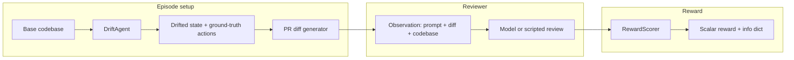

# CodeDrift Arena

**Train a code reviewer under live schema drift.** A frozen adversary mutates the synthetic repo (renames, deletions, API contract changes). The reviewer sees the **current** codebase plus a **PR diff** that may still reference the old world. A **deterministic scorer** turns the review into a GRPO-ready reward—no human labels per step.

> **30-second hook:** The UI shows **today’s codebase** and a diff written for **yesterday’s**. If they disagree, merging breaks production — the job is to **catch that mismatch** before ship.

| | |
|--|--|
| **Repo** | [github.com/bansalbhunesh/codedrift-arena](https://github.com/bansalbhunesh/codedrift-arena) |
| **🚀 Live Demo** | [](https://huggingface.co/spaces/Bhuneshlooper/CodeDrift) |
| **Stack** | Python · Gradio (CPU demo) · TRL GRPO + bitsandbytes QLoRA (GPU train) · OpenEnv HTTP bridge |

---

## Why judges care (30 seconds)

1. **Clear story** — Oversight agent (reviewer) vs adversary (drift) in a shared codebase; drift is structured and inspectable.
2. **Real RL hook** — Single-step MDP, dense sparse-ish reward, offline episode rows for fast iteration.
3. **Demo-safe CPU path** — Space runs **env + scorer only**; paste any model output and see reward + JSON breakdown instantly.
4. **Novelty without black boxes** — Drift types and ground-truth `DriftAction`s are explicit; reward rules are readable in `rewards/scorer.py`.

---

## Judge path (under 2 minutes)

```bash
git clone https://github.com/bansalbhunesh/codedrift-arena.git
cd codedrift-arena
pip install -r requirements.txt
python scripts/smoke_env.py
python -m unittest discover -s tests -p "test_*.py" -v
```

Optional narrative scripts: `python demo/before_after.py` (rename, contract, deleted-module, **two drifts at once**); `python demo/pitch_demo.py` mirrors those plus pitch framing (`--scenario rename|contract|removal|multi|all`, default `all`).

After each `env.step()`, **`info["metric_strip"]`** is a one-line summary (`reward`, `recall`, `verdict`, `malformed_issues`, **`grounded_in_diff`**). **`info["judge_keyword_line"]`** is a visceral headline (**`🟢 SUCCESS: …`** / **`🔴 FAILURE: …`** / partial). **`info["judge_emoji"]`** / **`info["judge_summary"]`** add **visual + plain-English** hints. **`info["judge_why_matters"]`** ties the outcome to **production impact**. **`info["confidence_strip"]`** is a **short** HIGH/MEDIUM/LOW line (e.g. `confidence: HIGH (fully grounded + full recall)`). Gradio Status shows **keyword**, emoji strip, summary, **💡 why**, then confidence.

## The Winning Demo (2 Minutes)

1. **Setup**: Run `python app.py` (Local) or visit the [Live Space](https://huggingface.co/spaces/Bhuneshlooper/CodeDrift).
2. **Step 1: The Drift**: Click **New episode**. Explain that the codebase on the right has changed (Renames/Deletions/Contracts mutated) while the PR on the left is still "stale".
3. **Step 2: The Failure**: Click **▶ Load Base Model (Fails)** and Score it. Show the **RED FAILURE** banner. Explain that even "smart" LLMs miss these drift bugs without specific training.
4. **Step 3: The Success**: Click **▶ Load Trained Model (Success)** and Score it. Show the **GREEN SUCCESS** banner.
5. **Step 4: The Proof**: Point to the **Training evidence** below. Show that the model learned to cite stale identifiers in the `ISSUES:` block.

---

## GRPO Training on Colab (T4 GPU)

To win, you need real training data. We use **GRPO** (Group Relative Policy Optimization) which optimizes for the deterministic reward without human labels.

1. **Open Colab**: Create a new notebook with a T4 GPU.
2. **Install Deps**:
   ```bash
   pip install -r https://raw.githubusercontent.com/bansalbhunesh/codedrift-arena/main/requirements-train.txt
   ```
3. **Run Training**:
   ```python
   # Run the train.py script directly or copy contents of training/train.py
   !python training/train.py --episodes 100 --steps 50
   ```
4. **Export Evidence**: The script saves a `final` LoRA adapter and logs to W&B. Replace the illustrative charts in `demo/sample_training_curve.md` with your real ones.

---

## Architecture



- **`DriftAgent`** (`agents/drift_agent.py`) — frozen; personalities (`random`, `subtle`, `aggressive`, `escalating`, `adaptive`) and difficulty (`easy` / `medium` / `hard`) control challenge.
- **`CodeDriftEnv`** (`env/codedrift_env.py`) — builds observation, caches reset obs through the single `step` (see API notes below).
- **`RewardScorer`** (`rewards/scorer.py`) — parses **`ISSUES:`** only for “did you cite the stale artifact?”; **`VERDICT:`** must be explicit.

---

## Review format (models must follow this)

The reviewer should answer in **exactly** this shape (used by the scorer and prompts):

```text
VERDICT: APPROVE | REQUEST_CHANGES
ISSUES: … list every stale reference, or write none …
REASON: one sentence.
```

**Scoring intuition (drifted PR):** credit comes from citing **stale** symbols / old signatures in **`ISSUES`**, with **`REQUEST_CHANGES`** when appropriate. Mentioning only the **new** name does not count as catching drift. Clean PRs (`n_stale_refs == 0`) expect **`VERDICT: APPROVE`** with **`ISSUES: none`** (or equivalent).

**Important:** `RewardScorer` parses mentions from **`ISSUES:`** (plus explicit **`VERDICT:`**).  
Diff grounding is also tracked and now softly affects catch reward when a non-empty diff is provided, while ISSUES remains the primary evidence channel.

**Pitch honesty:** The rubric scores **coverage of known drift** (did ISSUES cite the right stale artifacts with the right verdict shape)—not whether every sentence of reasoning is factually perfect.

---

## Live demo: failure modes (read before recording)

| Pitfall | What happens | Fix |
|--------|----------------|-----|
| Second **Score** without **New episode** | `RuntimeError` — single-step env | Click **New episode** between runs |
| Model skips **`ISSUES:`** | `malformed_issues`, no mention credit | Show the required template on-screen |
| Missing **`VERDICT:`** line | Defaults to **REQUEST_CHANGES** | Same — enforce template |
| Judging “wrong line number” in prose | Not scored; only ISSUES tokens + verdict | Say that in the pitch |

---

## Install matrix

| Goal | Command |
|------|---------|
| **HF Space / local CPU** | `pip install -r requirements.txt` |
| **GRPO training** (GPU, e.g. Colab) | `pip install -r requirements-train.txt` |
| **OpenEnv HTTP server** | `pip install -r requirements-server.txt` then `uvicorn server.app:app --host 0.0.0.0 --port 8000` |

Copy [`.env.example`](.env.example) to `.env` and set `CODEDRIFT_HF_*`, `WANDB_*` when you want clean logs and metadata (optional for the minimal demo).

---

## Production server config

`server/app.py` now includes production guardrails for auth, abuse prevention, signed sessions, and metrics access control.

Recommended baseline (private deployment):

```bash
export CODEDRIFT_REQUIRE_AUTH=1
export CODEDRIFT_API_READ_TOKEN=change-me-read
export CODEDRIFT_API_WRITE_TOKEN=change-me-write
export CODEDRIFT_API_RATE_LIMIT_RPM=120
export CODEDRIFT_API_MAX_BODY_BYTES=262144
export CODEDRIFT_SESSION_TTL_SECONDS=900
export CODEDRIFT_SESSION_SIGNING_KEY=change-me-strong-secret
export CODEDRIFT_SESSION_PREVIOUS_SIGNING_KEYS=
export CODEDRIFT_SESSION_MIN_SUPPORTED_SCHEMA_VERSION=1
export CODEDRIFT_METRICS_ACCESS=read
export CODEDRIFT_LOG_FORMAT=json
```

Optional for multi-instance deployments:

- Set `CODEDRIFT_REDIS_URL` to enable shared rate limits and shared session storage across replicas.
- Without Redis, set `CODEDRIFT_MAX_IN_MEMORY_SESSIONS` to bound RAM from unbounded `/api/v1/reset` abuse (oldest sessions are evicted first).
- Rotate session signing keys with `CODEDRIFT_SESSION_PREVIOUS_SIGNING_KEYS` (comma-separated old keys).
- Set `CODEDRIFT_TRUSTED_PROXIES` to a comma-separated list of addresses your app sees as the **direct client** for each trusted reverse proxy (same value space as the connection IP). Only then is `X-Forwarded-For` used for rate-limit keys; otherwise spoofed headers are ignored.

Typed API endpoints:

- `POST /api/v1/reset` → returns signed `session_id` + initial observation.
- `POST /api/v1/step` → single-use session scoring (`409` on replay).

---

## Environment API (important for demos & training)

| Method | Purpose |
|--------|---------|
| `reset()` | New random episode; drift agent runs; `episode_id` assigned. |
| `set_clean_episode(pr_diff)` | No drift; canonical codebase; for clean-PR training rows. |
| `inject_episode(...)` | Scripted episode for tests/demos; optional `validate=True` checks consistency. |
| `step(agent_response)` | **Single-step:** returns the **same** `Observation` as at episode start; `done` is `True`. |
| `debug_snapshot()` | Small dict: `episode_id`, `episode_ready`, `n_stale_refs`, etc. |

**Gotchas (live demo):**

- Calling **`step()` twice** without a new `reset` / `inject_episode` / `set_clean_episode` raises **`RuntimeError`** (by design).
- After scoring in the Gradio Space, click **New episode** before scoring again.
- If the model skips an **`ISSUES:`** block, mention credit is **zero** (malformed); do not put evidence only in **`REASON`**.

---

## Training (outline)

```bash
pip install -r requirements-train.txt
python training/train.py --help
```

Dataset rows are pre-generated episodes plus clean rows; the reward function deserializes ground-truth actions. Row-level failures log a traceback and assign **`-1.0`** (same scale as a single miss) so one bad batch line does not crash the trainer or dominate reward curves. Set `CODEDRIFT_LOG_LEVEL=DEBUG` to see per-row `recall` / outcome in training logs.

---

## Repository layout

| Path | Role |
|------|------|
| `env/` | `CodeDriftEnv`, synthetic `CodebaseState`, PR diff generation |
| `agents/` | `DriftAgent`, `DriftAction` |
| `rewards/` | `RewardScorer` |
| `training/` | `train.py` (GRPO) |
| `hf_space/` | Gradio UI (`space_app.py`) |
| `server/` | FastAPI OpenEnv app |
| `integrations/` | OpenEnv bridge, shared config |
| `codedrift/` | `constants.py`, `logutil.py` |
| `tests/` | Scorer + env lifecycle regressions |
| `scripts/smoke_env.py` | Quick env + OpenEnv stub check |

---

## Observability

Set `CODEDRIFT_LOG_LEVEL=DEBUG` for verbose logs (`codedrift/logutil.py`). Episode logs include **`episode_id`** on reset and step for correlating Space, OpenEnv, and training runs.

---

## Contributing / hackathon fork checklist

- [x] Deploy Space → **Live at https://huggingface.co/spaces/Bhuneshlooper/CodeDrift**
- [ ] Run `python scripts/smoke_env.py` and unit tests before recording.
- [ ] Rehearse: one **New episode** → click **▶ Load Trained Model** → **Score review** → **New episode** again.

Questions or tight demo slots: open an issue on the repo with your Space link and intended model backend (optional).
