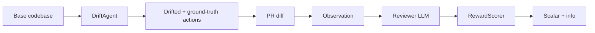
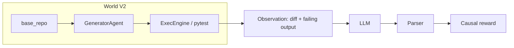

# CodeDrift Arena

**An [OpenEnv](https://github.com/)-style environment for training and evaluating code-review LLMs when the codebase has already moved on.**  
A **generator** mutates a mini-repo (renames, removals, contract changes, and more). A **PR** still points at the old world. **Pytest** is the ground truth. The model must **name the stale reference**, **trace the failure path**, and **request changes**—not match keywords.

| | |
|--|--|
| **Live demo** | [](https://huggingface.co/spaces/Bhuneshlooper/CodeDrift) |
| **Interactive slides** | [Open in browser](https://cdn.jsdelivr.net/gh/bansalbhunesh/codedrift-arena@main/docs/readme-slides.html) — Reveal.js deck (← →, **Esc** overview). Source: [`docs/readme-slides.html`](docs/readme-slides.html) |
| **Source** | [github.com/bansalbhunesh/codedrift-arena](https://github.com/bansalbhunesh/codedrift-arena) |
| **Stack** | Python · Gradio (CPU Space) · FastAPI + `openenv-core` (HTTP) · TRL **GRPO** + QLoRA (GPU train) · **pytest** as execution oracle (V2) |
| **Tests** | 60+ unit tests (v1 + v2) |

> **Note:** GitHub’s `README.md` is static. The slide deck is a normal HTML file you can open **locally** (`docs/readme-slides.html`) or via the link above (served from jsDelivr after `main` has the file).

---

## What this is (plain English)

A **training arena** where a model learns to review code like a **senior engineer**—not style nitpicks, but **real bugs** before they ship.

**The story (start to finish)**

1. A **bug is planted** — the system changes the repo (rename, remove a module, flip a condition, etc.).
2. A **PR arrives** — it still references the old code. It can look fine on a quick read.
3. **Tests run** — they **fail**. The failure log shows *where* it broke and *how* it crashed.
4. The **reviewer** reads the diff + failure output. It must find the **stale reference** and explain **why** it matters.
5. The **answer is scored** — right root cause? Sensible path? Right verdict? No hallucinated symbols?
6. The **model learns** — good answers are rewarded, bad ones penalized. Repeat.

After enough rounds, the policy gets **better at causal debugging**, not at memorizing approval templates.

**The four components**

| Component | What it does |
|-----------|----------------|
| **Generator** | Plants a realistic change (rename, removal, type mismatch, wrong condition, off-by-one, …). |
| **Execution engine** | Runs the **test suite** on the mutated code—failing output is the ground truth. |
| **Reviewer (LLM)** | Consumes the PR diff + (in V2) real pytest output; outputs a **structured** bug report. |
| **Reward / scorer** | Scores the report: root cause, failure path, verdict, confidence, anti-hallucination. |

**Why it’s different from typical “code review” demos**

| Typical | CodeDrift |
|---------|-----------|
| “Does this *look* right?” (subjective) | “**Will this break?**” — we **ran the tests** |
| Text similarity to a label | **Causal** trace from crash → stale symbol |
| Static prompts | **Adversarial loop**: the generator can **escalate** if the model wins too easily |

**Features in one line each**

- **Execution-based truth** — Tests pass or fail; no hand-labeled “correct” sentence.
- **Causal debugging** — Reward pushes **path-shaped** answers, not “test failed” alone.
- **Adversarial loop** — Adversary styles + adaptive curriculum: harder bugs when the reviewer is strong.
- **Difficulty scaling** — Levels (easy → hard) and multiple adversary **personalities** (including adaptive).

---

## What this environment actually trains

These are the **specific, measurable capabilities** a model gains from repeated episodes in this environment:

| Capability | What the model learns |
|---|---|
| **Stale reference detection** | Spot the exact symbol (function, module, call signature) that no longer exists — even when the PR looks syntactically valid |
| **Causal failure path tracing** | Trace backwards from test failure → intermediate caller → stale symbol (dependency-aware reasoning, not keyword search) |
| **Error type identification** | Rename → `AttributeError`, removal → `ModuleNotFoundError`, contract → `TypeError`, null → `NoneType`, etc. |
| **Verdict calibration** | APPROVE when there is no bug, REQUEST_CHANGES when there is — the model must discriminate, not always block |
| **Confidence calibration** | Overconfident wrong answers are penalized; the model learns to express belief accurately |
| **Anti-hallucination** | Citing a symbol that doesn't appear in the diff or codebase costs reward |
| **Completeness** | Catching all stale refs in a multi-mutation episode, not just the first one |

**What this does NOT train:** style linting, formatting preferences, test coverage advice, or anything that doesn't have an executable ground truth.

---

## Theme fit (for judges)

| Theme | Fit | Why |
|---|---|---|
| **#4 — Self-Improvement** | **~45%** | Adaptive adversary tracks reviewer win rate and escalates. Curriculum drives its own challenge level. The generator gets harder as the model gets better — recursive amplification. |
| **#3.1 — World Modeling (Professional Tasks)** | **~40%** | Real execution oracle (pytest), partially observable world (reviewer sees diff + tests, not the mutation), causal reward grounded in runtime facts, not human labels. |
| **#5 — Wild Card** | **~10%** | Executable ground truth for code review with no human labels anywhere in the reward loop is a genuinely novel training signal. |
| **#1 — Multi-Agent** | **~5%** | Generator vs Reviewer is adversarial, but the multi-agent interaction is implicit rather than the primary training story. |

**Primary submission: Theme #4 (Self-Improvement)** — the environment *adapts to the model* and drives recursive capability growth in causal code debugging. The adaptive adversary is the mechanism; the capability grown is professional-grade code review reasoning.

> Full technical write-up: [`BLOG.md`](BLOG.md)

---

## Modes & knobs (what everything does)

**Mission level** (how many distinct drift mutations are stacked per episode, before personality sampling):

| Level | Drifts / episode |
|-------|------------------|
| **easy** | 1 |
| **medium** | 2 |
| **hard** | 3 |

**Scenario preset** (overrides the two dropdowns below it for quick presets):

| Preset | Effect |
|--------|--------|
| **Random** | Uses your chosen **mission level** and **adversary style** as-is. |
| **Edge cases** | Forces **medium** difficulty + **subtle** adversary (harder, contract-biased bugs). |
| **Hard mode** | Forces **hard** + **adaptive** (strongest challenge in one click). |

**Adversary style** (how the drift agent **samples** bug types; same env API, different opponent):

| Style | Behavior |
|-------|----------|
| **random** | Samples from the full pattern pool: rename, removal, contract, partial_rename, null_missing, type_mismatch, condition_flip, off_by_one. |
| **subtle** | Biases toward **contract**-style changes (harder to spot); still respects easy/medium/hard **counts**. |
| **aggressive** | Only **rename / removal / contract**—loud, structural breaks. |
| **escalating** | **More** mutations per episode as the run count increases (capped by pool size). |
| **adaptive** | Uses reviewer **win-rate** to switch between aggressive, balanced, and subtle pressure; can target **weaker** bug families more often. The **Adversary brain** panel in the UI summarizes this when this mode is active. |

**Space-only features (Mission tab UI)**

- **Run / Outcome** — Left: parameters + **Deploy mission** + **Quick benchmark** (N episodes, base vs “trained” template). Right: **status strip** (ready / active / error).
- **Context** — Failing test output, PR diff, codebase snapshot, and full **prompt** the model would see.
- **Review** — **Load Junior** = fixed baseline `APPROVE` text; **Load Senior** = **episode-aware** structured response from **ground-truth** stale refs (wins for demos). **Submit review** runs the scorer.
- **Failure cascade** — Visual **test → … → stale ref** chain per bug (deeper = harder to trace).
- **Score breakdown (JSON)** — Full scorer output; **mission log** — last few scored rows.
- **Reset stats** — Clears XP / streak / production HUD without redeploying.

---

## Example walkthrough (toy)

**1. Bug planted** — generator renames `getUserData` → `fetchUserProfile`.

**2. PR diff** (still uses old name):

```text
+ result = getUserData(user_id)
```

**3. Test fails** (excerpt):

```text
AttributeError: module 'users' has no attribute 'getUserData'
  test_profile → get_user_dashboard → getUserData
```

**4. Junior (baseline)** — `VERDICT: APPROVE` … → **low / negative** reward: bug would ship.

**5. Senior (trained, structured report)** — `REQUEST_CHANGES`, cites **`getUserData`** as **root cause**, traces **failure path**, lists **ISSUES** with stale refs → **high** multi-component score.

---

## 30-second hook

The UI shows **today’s** codebase and a PR written for **yesterday’s**. If they disagree, merging breaks production—the reviewer’s job is to **catch the mismatch** before ship.

**V2** uses **real pytest** on a tiny in-repo test suite, surfaces the **actual** failure text to the model, and scores **ROOT_CAUSE**, **FAILURE_PATH**, and more.

---

## Repo layout

```text
codedrift-arena/
├── env/, agents/, rewards/          # V1: pattern-based reward, synthetic world
├── env_v2/, agents_v2/, rewards_v2/ # V2: pytest oracle + AST mutations + causal reward
├── training/, training_v2/         # GRPO (V1 / V2)
├── server/, integrations/         # FastAPI + OpenEnv bridges
├── hf_space/                      # Gradio UI (Space)
├── tests/, tests_v2/
├── colab/
├── demo/
└── openenv.yaml
```

---

## V1 vs V2

| | **V1** | **V2 (primary for “executable truth”)** |
|--|--------|----------------------------------------|
| Ground truth | DriftAction + heuristics | **Subprocess pytest** on mutated tree |
| Mutations | Symbol-table style | **AST**-based (stdlib `ast` + patterns) |
| Review format | `VERDICT` + `ISSUES` + `REASON` | Adds **`ROOT_CAUSE`**, **`FAILURE_PATH`**, **`CONFIDENCE`**, etc. |
| Reward | Token recall + grounding | **Causal** components + calibration + anti-hallucination |

V1 is kept for backward compatibility; new work targets **V2** paths in `env_v2/`, `rewards_v2/`, `training_v2/`.

---

## How to use the live demo (Hugging Face Space)

**URL:** [huggingface.co/spaces/Bhuneshlooper/CodeDrift](https://huggingface.co/spaces/Bhuneshlooper/CodeDrift) — no install.

### Quick start (Mission — full loop)

1. Open the **Mission** tab.
2. Set **mission level**, **adversary style**, **scenario preset** (or leave **Random**), and **seed** (reproducible bugs).
3. Click **Deploy mission** — the **Outcome** panel shows *Active* with an episode id; **Context** fills with failing tests, diff, and codebase.
4. Click **Load Junior** to paste a naïve baseline review, or **Load Senior** for a structured response aligned with this episode’s real stale references.
5. Edit the **Reviewer report** if you like, then **Submit review** — the banner shows **XP**, **caught / missed** stale refs, and the **JSON** box shows the full score.
6. Use **Reset stats** if you only want to clear the top HUD (XP, streak, production health) without changing the mission.

**Quick benchmark (same tab)** — After choosing settings, set **Benchmark size** and click **Quick benchmark** to run **N** episodes and compare baseline vs “Senior”-style response **in the aggregate** (summary appears in **Outcome** / scorer output depending on build).

### Battle tab — what it is (headline for judges)

**Battle** is a **controlled A/B** on the **exact same bug**: one **seed**, one **mission level**, one **adversary** — two independent environment resets, **identical** episode.

- **Run Battle**  
  - **Junior** = fixed canned `APPROVE` review (ships the bug).  
  - **Senior** = template filled from this episode’s **ground-truth** stale refs and failure information.  
  - You get a **side-by-side** card: both reviews, both rewards, **delta** (training advantage in reward / XP), plus **failure path** and bug **pattern** label. **Detail (JSON)** has numeric breakdown.

*Why it’s impressive:* In one click you show **the same PR and tests**, **only** the review text changes, and the scorer **splits** the models—no cherry-picked seeds in the UI.

**Gauntlet (best-of-N)** — **Run Gauntlet** runs **3–10** consecutive episodes (`seed`, `seed+1`, …) with the same difficulty/adversary. You get a **table** of rounds (pattern, stale ref, Junior vs Senior reward) and a **wins** count. Use this to show **consistency** of the gap, not a single lucky seed.

### Leaderboard tab

1. Set **Missions in this run**, **Seed**, **Mission level**, **Adversary style**.  
2. **Run Leaderboard** — same **N** missions for Junior and Senior policies.  
3. You get **summary tiles** (avg XP, recall, win rate, ties), **bar charts** (per-episode and per **bug family**), and a **per-mission table** (deltas, stale refs). Best for “paper-ready” **aggregate** comparisons.

### Real PR tab

1. **Diff & detection** — Paste a **unified diff**, or paste a **GitHub URL** and **Fetch from GitHub**.  
2. **Detect languages + candidate stale refs** helps pre-fill candidates (heuristic; **edit** the list).  
3. **Review & score** — Paste your `VERDICT` / `ISSUES` / etc., choose **drift kind** for scoring, **Score real PR**. This path uses the **V1-style** real-diff scorer (does **not** run the project’s full pytest for arbitrary repos; see on-tab note).

### About tab

Short explanation of **setup**, **reward**, **training**, and **evaluation** in plain language.

---

## How to run locally

### 1) Clone, tests, and Gradio (CPU) — env + tests + Gradio

```bash
git clone https://github.com/bansalbhunesh/codedrift-arena.git
cd codedrift-arena
pip install -r requirements.txt
python scripts/smoke_env.py
python -m unittest discover -s tests -p "test_*.py" -v
python -m unittest discover -s tests_v2 -p "test_*.py" -v
python app.py   # Gradio
```

### 2) OpenEnv HTTP server

```bash
pip install -r requirements-server.txt
uvicorn server.app:app --host 0.0.0.0 --port 8000
```

V2 app builder: `integrations.codedrift_openenv_v2.build_openenv_app_v2()` (mount under `/api/v2/…` as in source).

### 3) Training

```bash
pip install -r requirements-train.txt
python training/train.py --episodes 200 --steps 100 --backend hf          # V1
python training_v2/train_v2.py --episodes 200 --steps 100 --output_dir outputs/v2_run   # V2
```

Held-out / plotting (V2) — see existing [`training_v2/eval_generalization_v2.py`](training_v2/eval_generalization_v2.py) and [`utils_v2/plot_curve.py`](utils_v2/plot_curve.py).

---

## Architecture (high level)

### V1



### V2



---

## Review format (scorer-facing)

```text
VERDICT: APPROVE | REQUEST_CHANGES
ROOT_CAUSE: <file::symbol or description>
FAILURE_PATH: test → caller → symbol → …
CONFIDENCE: 0.0..1.0
ISSUES: <each stale / broken reference>
REASON: one line
```

V1 scoring uses a subset; V2 uses the full structured **causal** breakdown.

### V2 reward (conceptual)

Multipliers are implemented in [`rewards_v2/causal_scorer.py`](rewards_v2/causal_scorer.py). Rough shape:

- **Root cause** — match on the true stale reference (with partial credit where defined).
- **Failure path** — overlap with the ground-truth call chain.
- **Verdict** — align with “would this ship a bug?”
- **Calibration** / **hallucination** — penalize overconfidence and invented symbols.

Total is **bounded** so training stays stable; malformed output gets a fixed penalty (see code).

---

## OpenEnv

| | |
|--|--|
| Manifest | [`openenv.yaml`](openenv.yaml) |
| Default server | `uvicorn server.app:app` |

V1: `POST /api/v1/reset`, `POST /api/v1/step` (session + single use per step as implemented).

---

## Install matrix

| Goal | Command |
|------|--------|
| Space / local UI | `pip install -r requirements.txt` |
| Server | `pip install -r requirements-server.txt` |
| Training | `pip install -r requirements-train.txt` |
| Plots (V2) | `pip install matplotlib` + `utils_v2/plot_curve.py` |

---

## Common pitfalls (demo)

| What | Why |
|------|-----|
| **Submit** twice on the same mission | One-step env: deploy a **new** mission to score again. |
| Missing `ISSUES:` / structured lines | Treated as malformed—use the on-screen template. |
| Citing the **new** name only | Stale ref is the **old** symbol the PR still uses. |
| Real PR: empty stale list | Add refs manually if heuristics miss them. |

---

## Submission / roadmap checklist (optional)

- [x] HF Space, OpenEnv manifest, V1 + V2 stacks + tests
- [x] Real-PR path + design-system Gradio UI
- [x] Battle + Leaderboard in Space
- [ ] Long run + curves in `outputs/`
- [ ] Public adapter on Hub + short demo video

---

## Code map

| Area | Path |
|------|------|
| V1 env / drift / score | `env/codedrift_env.py`, `agents/drift_agent.py`, `rewards/scorer.py` |
| V2 env / generator / causal reward | `env_v2/exec_arena_env.py`, `agents_v2/generator_agent.py`, `rewards_v2/causal_scorer.py` |
| V2 training | `training_v2/train_v2.py`, `curriculum.py`, `replay.py` |
| Gradio Space | `hf_space/space_app.py`, `hf_space/real_pr_scorer.py` |
| OpenEnv bridges | `integrations/codedrift_openenv.py`, `integrations/codedrift_openenv_v2.py` |
| Tests | `tests/`, `tests_v2/` |

---

## License

[MIT](LICENSE)

---

*Questions, repros, or demo links: open an issue.*
