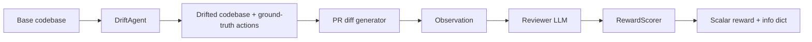
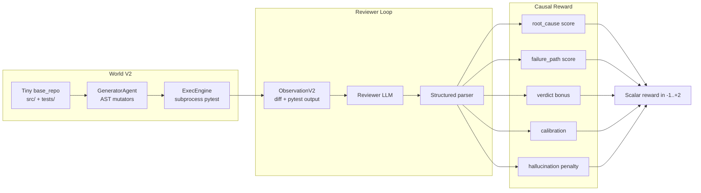

# 🏟️ CodeDrift Arena

> **An OpenEnv environment for training and evaluating code-review LLMs under live codebase drift.**
> A frozen adversary mutates the world (renames, deletions, API contract changes, type/condition/off-by-one bugs).
> The reviewer must read the **PR diff** plus the **failing pytest output** and trace the failure to its **exact root cause**.
> Reward is multi-component and **causal**, not text-matching.

| | |
|--|--|
| 🚀 **Live demo** | [](https://huggingface.co/spaces/Bhuneshlooper/CodeDrift) |
| 📂 **Source** | [github.com/bansalbhunesh/codedrift-arena](https://github.com/bansalbhunesh/codedrift-arena) |
| 🧱 **Stack** | Python · Gradio (CPU demo) · FastAPI + `openenv-core` (HTTP bridge) · TRL GRPO + bitsandbytes QLoRA + optional Unsloth (GPU train) · pytest as ground-truth oracle (V2) |
| 🧪 **Tests** | 43 v1 + 19 v2, all passing locally and in CI |

---

## 🎯 Hackathon theme fit

| Theme | Fit | Why |
|-------|------|-----|
| **#3.1 World Modeling — Professional Tasks** | **PRIMARY** ✅ | Real codebase, real test execution as ground truth, multi-step reasoning over a partially observable repo, causal reward instead of pattern matching. |
| **#4 Self-Improvement** | Strong | Adaptive adversary, replay buffer of hard episodes, weakness-weighted curriculum, difficulty auto-promotion (`easy → medium → hard`). |
| **#5 Wild Card** | Strong | "Code review under schema drift" is a novel and concrete RL framing for an LLM oversight problem. |
| **#1 Multi-Agent** | Partial | Reviewer vs adversary loop with adaptive opponent, but not full negotiation/coalition. |
| **#2 Long-Horizon Planning** | Partial | Episodes are single-step by design (deterministic, easy to reward). Multi-turn variant is an obvious extension. |
| **#3.2 Personalized Tasks** | N/A | Out of scope. |

---

## ⚡ 30-second hook

The UI shows **today's codebase** and a PR written for **yesterday's**.
If they disagree, merging breaks production — the reviewer's job is to **catch that mismatch** before ship.

In V2 we go one step further: we **actually execute pytest** on the drifted repo, show the agent the real failing test output, and reward it for tracing the failure to the **exact stale symbol** that broke it.

---

## 🧭 Repo at a glance

```
codedrift-arena/
├── env/, agents/, rewards/         # V1 stack: text-pattern reward, synthetic codebase
├── env_v2/, agents_v2/, rewards_v2/  # V2 stack: pytest oracle + causal reward
├── training/                       # V1 GRPO trainer (Qwen 2.5 1.5B + QLoRA)
├── training_v2/                    # V2 GRPO trainer + curriculum + replay + generalization eval
├── server/, integrations/          # FastAPI + OpenEnv bridges (V1 and V2)
├── hf_space/                       # Gradio UI (synthetic arena + Real PR + Comparison Dashboard)
├── tests/, tests_v2/               # 43 + 19 unit tests
├── colab/                          # Colab training notebook
├── demo/                           # Pitch demos and recorded artifacts
└── openenv.yaml                    # OpenEnv manifest
```

---

## 🏁 Three ways to run it

### 1. Click around the live Space (no install)

[`https://huggingface.co/spaces/Bhuneshlooper/CodeDrift`](https://huggingface.co/spaces/Bhuneshlooper/CodeDrift)

The Space has **three sections**:

| Section | What it does |
|---------|--------------|
| 🏟️ **Synthetic Arena** | New episode → Base/Trained buttons → Score → see reward + JSON + replay row. |
| 📊 **Comparison Dashboard** | Run N episodes; see metric cards + bar charts (per-episode, per-drift-type) + detail table. |
| 🌍 **Real PR Scorer** | Paste a `git diff` OR a GitHub URL (PR/commit/compare). Auto-detect language + candidate stale refs. Edit + score. |

### 2. Run the env + scorer locally (CPU only)

```bash
git clone https://github.com/bansalbhunesh/codedrift-arena.git
cd codedrift-arena
pip install -r requirements.txt
python scripts/smoke_env.py
python -m unittest discover -s tests -p "test_*.py" -v       # v1 (43 tests)
python -m unittest discover -s tests_v2 -p "test_*.py" -v    # v2 (19 tests)
python app.py                                                # launches Gradio
```

### 3. Run the OpenEnv HTTP server

```bash
pip install -r requirements-server.txt
uvicorn server.app:app --host 0.0.0.0 --port 8000      # V1 typed API
# V2 OpenEnv app is exposed by integrations.codedrift_openenv_v2.build_openenv_app_v2()
```

---

## 🔁 The two arenas (V1 and V2 side by side)

| | **V1 — Text-pattern arena** | **V2 — Executable arena** |
|--|------------------------------|----------------------------|
| Ground truth | Hand-coded `DriftAction` tokens | **Real pytest output** on a freshly mutated repo |
| Mutation | Symbol-table edits | **AST-level edits** (`libcst`-style with stdlib `ast`) |
| Bug patterns | rename, removal, contract | All 8: rename, removal, contract, partial_rename, null_missing, type_mismatch, condition_flip, off_by_one |
| Reviewer output | `VERDICT` + `ISSUES` + `REASON` | Adds **`ROOT_CAUSE`**, **`FAILURE_PATH`**, **`CONFIDENCE`** |
| Reward | Recall over stale tokens + diff grounding | **Multi-component causal reward** (root_cause, failure_path, verdict, calibration, hallucination) |
| Tests | 43 unit tests | 19 unit tests |
| Demo entry | `demo/before_after.py`, Gradio | `demo/v2_pitch_demo.py`, Gradio dashboard |

V1 stays untouched so existing demos still work. V2 modules live in `env_v2/`, `agents_v2/`, `rewards_v2/`, `training_v2/`, `tests_v2/`.

---

## 🧱 Architecture

### V1 (text-pattern arena)



### V2 (executable arena, primary submission)



---

## ✍️ Review format the scorer expects

```text
VERDICT: APPROVE | REQUEST_CHANGES
ROOT_CAUSE: <file_path>::<symbol>          # e.g. src/orders.py::createOrder
FAILURE_PATH: test_id → caller → symbol
CONFIDENCE: 0.0..1.0
ISSUES: <cite each stale reference here>
REASON: one sentence
```

In V1 only `VERDICT` / `ISSUES` / `REASON` are required; in V2 the structured fields drive the causal reward components.

---

## 🧮 How the V2 reward is built

```
R = 1.0 * root_cause            # exact symbol match (file::name preferred, partial credit allowed)
  + 0.6 * failure_path          # ordered overlap with ground-truth chain
  + 0.2 * verdict               # APPROVE iff no failing test, else REQUEST_CHANGES
  - 0.4 * hallucination         # predicted symbol absent from repo / diff
  - 0.2 * calibration_error     # Brier-style penalty for over- or under-confidence
```

`R` is clamped to `[-1.0, +2.0]`. Malformed predictions (no JSON / wrong keys) get a fixed `-0.5` so the model can't game the system by emitting noise.

---

## 🧰 What's in the Space UI

### 🏟️ Synthetic Arena
- **🔄 New episode** → spawn a drifted repo + diff + failing-test output
- **▶ Base Model (Fails)** → fixed-text APPROVE; demonstrates a naive baseline
- **▶ Trained Model (Wins)** → **episode-aware**: builds the structured response from the **actual** stale refs of the current episode, so the win is real, not a fixed string
- **⚖️ Score review** → run scorer; see headline status + JSON + replay row
- **🚀 Run Benchmark** → N-episode aggregate Base vs Trained
- **🔁 Replay Failure Cases** → keeps the last 8 scored attempts visible

### 📊 Comparison Dashboard
- **Headline metric cards**: Avg reward, Avg recall, Win rate, Ties (with delta arrows + color)
- **Bar chart**: per-episode reward, colored by policy
- **Bar chart**: avg reward by drift type, colored by policy
- **Detail table**: episode, drift_type, stale_ref, base_reward, trained_reward, delta

### 🌍 Real PR Scorer
- **🔗 GitHub URL** (PR / commit / compare / raw) → click **Fetch from GitHub** → diff + candidate stale refs auto-populate
- **📥 Paste diff** directly (any language) — Python, JS/TS, Go, Java, Rust, C/C++, Swift, Kotlin, Ruby, PHP, Scala, C#
- **🔎 Detect** → languages + candidate stale references (heuristic, editable)
- **⚖️ Score Real PR** → reuses the V1 reward pipeline against your confirmed stale refs

---

## 🧪 GRPO training paths

### V1 trainer (existing, deterministic-reward GRPO)

```bash
pip install -r requirements-train.txt
python training/train.py --episodes 200 --steps 100 --backend hf
```

### V2 trainer (executable + causal reward)

```bash
pip install -r requirements-train.txt
python training_v2/train_v2.py --episodes 200 --steps 100 --output_dir outputs/v2_run
```

Both trainers ship dtype guards and a Windows UTF-8 self-restart so they run on Colab T4 + on Python 3.11/3.12 venvs cleanly.

### Held-out generalization eval (V2)

```bash
python training_v2/eval_generalization_v2.py --policy oracle  --episodes 30 --out outputs/v2_eval_oracle.jsonl
python training_v2/eval_generalization_v2.py --policy approve --episodes 30 --out outputs/v2_eval_baseline.jsonl
python training_v2/eval_generalization_v2.py --policy llm --model Qwen/Qwen2.5-1.5B-Instruct --adapter outputs/v2_run/final --episodes 30 --out outputs/v2_eval_trained.jsonl
python utils_v2/plot_curve.py --input outputs/v2_eval_oracle.jsonl --out_curve outputs/v2_curve.png --out_bars outputs/v2_bars.png
```

Train pattern set: `{rename, removal, contract, partial_rename, null_missing}`.
Held-out pattern set: `{type_mismatch, condition_flip, off_by_one}`.
You get per-component reward, root-cause accuracy, and a per-pattern bar chart.

---

## 🔌 OpenEnv bridge

| Manifest | Server entrypoint |
|----------|-------------------|
| `openenv.yaml` | `uvicorn server.app:app --host 0.0.0.0 --port 8000` |

V1 typed API:

- `POST /api/v1/reset` — returns signed `session_id` + initial observation
- `POST /api/v1/step` — single-use session scoring (`409` on replay)

V2 OpenEnv app:

- `from integrations.codedrift_openenv_v2 import build_openenv_app_v2`
- Same `reset` / `step` shape, structured ObservationV2 with `pytest_output`, `failing_tests`, `repo_snapshot`, etc.

---

## 🧱 Production server config (V1)

```bash
export CODEDRIFT_REQUIRE_AUTH=1
export CODEDRIFT_API_READ_TOKEN=change-me-read
export CODEDRIFT_API_WRITE_TOKEN=change-me-write
export CODEDRIFT_API_RATE_LIMIT_RPM=120
export CODEDRIFT_API_MAX_BODY_BYTES=262144
export CODEDRIFT_SESSION_TTL_SECONDS=900
export CODEDRIFT_SESSION_SIGNING_KEY=change-me-strong-secret
export CODEDRIFT_METRICS_ACCESS=read
```

Optional for multi-instance deployments:

- `CODEDRIFT_REDIS_URL` — shared rate limits + session storage
- `CODEDRIFT_MAX_IN_MEMORY_SESSIONS` — RAM cap when Redis is off
- `CODEDRIFT_SESSION_PREVIOUS_SIGNING_KEYS` — graceful key rotation
- `CODEDRIFT_TRUSTED_PROXIES` — IPs allowed to set `X-Forwarded-For`

---

## 📦 Install matrix

| Goal | Install | Run |
|------|---------|-----|
| **HF Space / local CPU** | `pip install -r requirements.txt` | `python app.py` |
| **OpenEnv HTTP server** | `pip install -r requirements-server.txt` | `uvicorn server.app:app --host 0.0.0.0 --port 8000` |
| **GRPO training** | `pip install -r requirements-train.txt` | `python training/train.py` or `python training_v2/train_v2.py` |
| **V2 plotting** | `pip install matplotlib` | `python utils_v2/plot_curve.py --input outputs/v2_eval.jsonl ...` |

---

## 🧯 Live demo: known pitfalls

| Pitfall | What happens | Fix |
|---------|--------------|-----|
| Click `Score` twice without `New episode` | `RuntimeError` — single-step env | Click `🔄 New episode` first |
| Reviewer skips `ISSUES:` | `malformed_issues=true`, no mention credit | Use the on-screen template |
| Reviewer cites only the new symbol | Counts as missed drift | Cite the **stale** identifier |
| Real PR detector returns `none` | Diff has no clean +/- pairs (e.g. only additions) | Edit stale refs manually |

---

## ✅ Submission checklist

- [x] Live HF Space — [`Bhuneshlooper/CodeDrift`](https://huggingface.co/spaces/Bhuneshlooper/CodeDrift)
- [x] OpenEnv manifest (`openenv.yaml`)
- [x] V1 stack (env + reward + GRPO trainer + tests)
- [x] V2 stack (executable env + causal reward + curriculum + replay + tests)
- [x] Real-PR scorer with multi-language auto-detect + GitHub URL fetch
- [x] Comparison Dashboard with metric cards + bar charts
- [x] Held-out generalization eval script
- [x] Colab training notebook (`colab/CodeDrift_GRPO.ipynb`)
- [ ] Run 200+ step training run, commit reward curves under `outputs/v2_run/`
- [ ] Link the trained adapter (HF model card)
- [ ] Record a 60-90 second demo video

---

## 📚 Where to read the code

| Area | Path |
|------|------|
| V1 env / agents / reward | [`env/codedrift_env.py`](env/codedrift_env.py), [`agents/drift_agent.py`](agents/drift_agent.py), [`rewards/scorer.py`](rewards/scorer.py) |
| V2 env / generator / scorer | [`env_v2/exec_arena_env.py`](env_v2/exec_arena_env.py), [`agents_v2/generator_agent.py`](agents_v2/generator_agent.py), [`rewards_v2/causal_scorer.py`](rewards_v2/causal_scorer.py) |
| V2 training + curriculum | [`training_v2/train_v2.py`](training_v2/train_v2.py), [`training_v2/curriculum.py`](training_v2/curriculum.py), [`training_v2/replay.py`](training_v2/replay.py) |
| V2 generalization eval | [`training_v2/eval_generalization_v2.py`](training_v2/eval_generalization_v2.py) |
| Gradio Space UI | [`hf_space/space_app.py`](hf_space/space_app.py), [`hf_space/real_pr_scorer.py`](hf_space/real_pr_scorer.py) |
| OpenEnv bridges | [`integrations/codedrift_openenv.py`](integrations/codedrift_openenv.py), [`integrations/codedrift_openenv_v2.py`](integrations/codedrift_openenv_v2.py) |
| Tests | [`tests/`](tests/), [`tests_v2/`](tests_v2/) |

---

## 📝 License

MIT — see [`LICENSE`](LICENSE).

---

Questions or tight demo slots: open an issue with your Space link.
