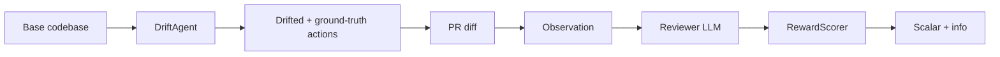
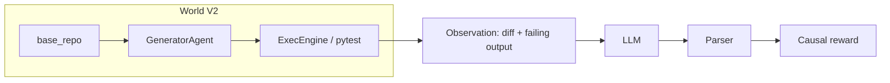

# CodeDrift Arena

**An [OpenEnv](https://github.com/)-style environment for training and evaluating code-review LLMs when the codebase has already moved on.**  
A **generator** mutates a mini-repo (renames, removals, contract changes, and more). A **PR** still points at the old world. **Pytest** is the ground truth. The model must **name the stale reference**, **trace the failure path**, and **request changes**—not match keywords.

| | |
|--|--|
| **Live demo** | [](https://huggingface.co/spaces/Bhuneshlooper/CodeDrift) |
| **Source** | [github.com/bansalbhunesh/codedrift-arena](https://github.com/bansalbhunesh/codedrift-arena) |
| **Stack** | Python · Gradio (CPU Space) · FastAPI + `openenv-core` (HTTP) · TRL **GRPO** + QLoRA (GPU train) · **pytest** as execution oracle (V2) |
| **Tests** | 60+ unit tests (v1 + v2) |

---

## What this is (plain English)

A **training arena** where a model learns to review code like a **senior engineer**—not style nitpicks, but **real bugs** before they ship.

**The story (start to finish)**

1. A **bug is planted** — the system changes the repo (rename, remove a module, flip a condition, etc.).
2. A **PR arrives** — it still references the old code. It can look fine on a quick read.
3. **Tests run** — they **fail**. The failure log shows *where* it broke and *how* it crashed.
4. The **reviewer** reads the diff + failure output. It must find the **stale reference** and explain **why** it matters.
5. The **answer is scored** — right root cause? Sensible path? Right verdict? No hallucinated symbols?
6. The **model learns** — good answers are rewarded, bad ones penalized. Repeat.

After enough rounds, the policy gets **better at causal debugging**, not at memorizing approval templates.

**The four components**

| Component | What it does |
|-----------|----------------|
| **Generator** | Plants a realistic change (rename, removal, type mismatch, wrong condition, off-by-one, …). |
| **Execution engine** | Runs the **test suite** on the mutated code—failing output is the ground truth. |
| **Reviewer (LLM)** | Consumes the PR diff + (in V2) real pytest output; outputs a **structured** bug report. |
| **Reward / scorer** | Scores the report: root cause, failure path, verdict, confidence, anti-hallucination. |

**Why it’s different from typical “code review” demos**

| Typical | CodeDrift |
|---------|-----------|
| “Does this *look* right?” (subjective) | “**Will this break?**” — we **ran the tests** |
| Text similarity to a label | **Causal** trace from crash → stale symbol |
| Static prompts | **Adversarial loop**: the generator can **escalate** if the model wins too easily |

**Features in one line each**

- **Execution-based truth** — Tests pass or fail; no hand-labeled “correct” sentence.
- **Causal debugging** — Reward pushes **path-shaped** answers, not “test failed” alone.
- **Adversarial loop** — Adversary styles + adaptive curriculum: harder bugs when the reviewer is strong.
- **Difficulty scaling** — Levels (e.g. easy → hard) and multiple adversary **personalities** (including adaptive).

---

## Hackathon / track theme fit (estimated)

These percentages are a **rough** split of where the *emphasis* sits—not a formal metric.

| Track | % | Why |
|-------|---|-----|
| **#3.1 — World modeling (professional tasks)** | **~42%** | Real repo + tools (pytest), partial observability, state that updates on actions, **causal** reward—not pattern-matching. |
| **#4 — Self-improvement** | **~28%** | Adaptive curriculum, replay of hard episodes, difficulty promotion, generator vs reviewer co-evolution. |
| **#5 — Wild card** | **~12%** | “Schema drift + PR review + RL” is a distinct, high-value story for LLM training. |
| **#1 — Multi-agent** | **~10%** | Clear **adversary vs reviewer** loop; not negotiation, markets, or coalitions. |
| **#2 — Long-horizon planning** | **~8%** | Each episode is **one step** for clean credit assignment; long chains are a natural extension. |
| **#3.2 — Personalized tasks** | **0%** | Out of scope. |

If you have to name **one** track: **#3.1** is the closest fit, with **#4** a strong second.

---

## Example walkthrough (toy)

**1. Bug planted** — generator renames `getUserData` → `fetchUserProfile`.

**2. PR diff** (still uses old name):

```text
+ result = getUserData(user_id)
```

**3. Test fails** (excerpt):

```text
AttributeError: module 'users' has no attribute 'getUserData'
  test_profile → get_user_dashboard → getUserData
```

**4. Junior (baseline)** — `VERDICT: APPROVE` … → **low / negative** reward: bug would ship.

**5. Senior (trained, structured report)** — `REQUEST_CHANGES`, cites **`getUserData`** as **root cause**, traces **failure path**, lists **ISSUES** with stale refs → **high** multi-component score.

---

## 30-second hook

The UI shows **today’s** codebase and a PR written for **yesterday’s**. If they disagree, merging breaks production—the reviewer’s job is to **catch the mismatch** before ship.

**V2** uses **real pytest** on a tiny in-repo test suite, surfaces the **actual** failure text to the model, and scores **ROOT_CAUSE**, **FAILURE_PATH**, and more.

---

## Repo layout

```text
codedrift-arena/
├── env/, agents/, rewards/          # V1: pattern-based reward, synthetic world
├── env_v2/, agents_v2/, rewards_v2/ # V2: pytest oracle + AST mutations + causal reward
├── training/, training_v2/         # GRPO (V1 / V2)
├── server/, integrations/         # FastAPI + OpenEnv bridges
├── hf_space/                      # Gradio UI (Space)
├── tests/, tests_v2/
├── colab/
├── demo/
└── openenv.yaml
```

---

## V1 vs V2

| | **V1** | **V2 (primary for “executable truth”)** |
|--|--------|----------------------------------------|
| Ground truth | DriftAction + heuristics | **Subprocess pytest** on mutated tree |
| Mutations | Symbol-table style | **AST**-based (stdlib `ast` + patterns) |
| Review format | `VERDICT` + `ISSUES` + `REASON` | Adds **`ROOT_CAUSE`**, **`FAILURE_PATH`**, **`CONFIDENCE`**, etc. |
| Reward | Token recall + grounding | **Causal** components + calibration + anti-hallucination |

V1 is kept for backward compatibility; new work targets **V2** paths in `env_v2/`, `rewards_v2/`, `training_v2/`.

---

## How to run

### 1) Live Space (no install)

**[Bhuneshlooper/CodeDrift on Hugging Face](https://huggingface.co/spaces/Bhuneshlooper/CodeDrift)**

| Tab | What you do |
|-----|-------------|
| **Mission** | Set difficulty & adversary → **Deploy mission** → **Load Junior / Senior** → **Submit review** → see score, JSON, log. |
| **Battle** | Same seed & settings → **Run Battle** (Junior vs Senior on one bug) or **Run Gauntlet** (best-of-N). |
| **Leaderboard** | **Run Leaderboard** for N episodes → metrics, bar charts, per-mission table. |
| **Real PR** | Paste a diff or **fetch from GitHub** → adjust stale refs → **Score**. |
| **About** | How training and scoring are set up. |

### 2) Local (CPU) — env + tests + Gradio

```bash
git clone https://github.com/bansalbhunesh/codedrift-arena.git
cd codedrift-arena
pip install -r requirements.txt
python scripts/smoke_env.py
python -m unittest discover -s tests -p "test_*.py" -v
python -m unittest discover -s tests_v2 -p "test_*.py" -v
python app.py   # Gradio
```

### 3) OpenEnv HTTP server

```bash
pip install -r requirements-server.txt
uvicorn server.app:app --host 0.0.0.0 --port 8000
```

V2 app builder: `integrations.codedrift_openenv_v2.build_openenv_app_v2()` (mount under `/api/v2/…` as in source).

### 4) Training

```bash
pip install -r requirements-train.txt
python training/train.py --episodes 200 --steps 100 --backend hf          # V1
python training_v2/train_v2.py --episodes 200 --steps 100 --output_dir outputs/v2_run   # V2
```

Held-out / plotting (V2) — see existing [`training_v2/eval_generalization_v2.py`](training_v2/eval_generalization_v2.py) and [`utils_v2/plot_curve.py`](utils_v2/plot_curve.py).

---

## Architecture (high level)

### V1



### V2



---

## Review format (scorer-facing)

```text
VERDICT: APPROVE | REQUEST_CHANGES
ROOT_CAUSE: <file::symbol or description>
FAILURE_PATH: test → caller → symbol → …
CONFIDENCE: 0.0..1.0
ISSUES: <each stale / broken reference>
REASON: one line
```

V1 scoring uses a subset; V2 uses the full structured **causal** breakdown.

### V2 reward (conceptual)

Multipliers are implemented in [`rewards_v2/causal_scorer.py`](rewards_v2/causal_scorer.py). Rough shape:

- **Root cause** — match on the true stale reference (with partial credit where defined).
- **Failure path** — overlap with the ground-truth call chain.
- **Verdict** — align with “would this ship a bug?”
- **Calibration** / **hallucination** — penalize overconfidence and invented symbols.

Total is **bounded** so training stays stable; malformed output gets a fixed penalty (see code).

---

## OpenEnv

| | |
|--|--|
| Manifest | [`openenv.yaml`](openenv.yaml) |
| Default server | `uvicorn server.app:app` |

V1: `POST /api/v1/reset`, `POST /api/v1/step` (session + single use per step as implemented).

---

## Install matrix

| Goal | Command |
|------|--------|
| Space / local UI | `pip install -r requirements.txt` |
| Server | `pip install -r requirements-server.txt` |
| Training | `pip install -r requirements-train.txt` |
| Plots (V2) | `pip install matplotlib` + `utils_v2/plot_curve.py` |

---

## Common pitfalls (demo)

| What | Why |
|------|-----|
| **Submit** twice on the same mission | One-step env: deploy a **new** mission to score again. |
| Missing `ISSUES:` / structured lines | Treated as malformed—use the on-screen template. |
| Citing the **new** name only | Stale ref is the **old** symbol the PR still uses. |
| Real PR: empty stale list | Add refs manually if heuristics miss them. |

---

## Submission / roadmap checklist (optional)

- [x] HF Space, OpenEnv manifest, V1 + V2 stacks + tests
- [x] Real-PR path + design-system Gradio UI
- [x] Battle + Leaderboard in Space
- [ ] Long run + curves in `outputs/`
- [ ] Public adapter on Hub + short demo video

---

## Code map

| Area | Path |
|------|------|
| V1 env / drift / score | `env/codedrift_env.py`, `agents/drift_agent.py`, `rewards/scorer.py` |
| V2 env / generator / causal reward | `env_v2/exec_arena_env.py`, `agents_v2/generator_agent.py`, `rewards_v2/causal_scorer.py` |
| V2 training | `training_v2/train_v2.py`, `curriculum.py`, `replay.py` |
| Gradio Space | `hf_space/space_app.py`, `hf_space/real_pr_scorer.py` |
| OpenEnv bridges | `integrations/codedrift_openenv.py`, `integrations/codedrift_openenv_v2.py` |
| Tests | `tests/`, `tests_v2/` |

---

## License

[MIT](LICENSE)

---

*Questions, repros, or demo links: open an issue.*
